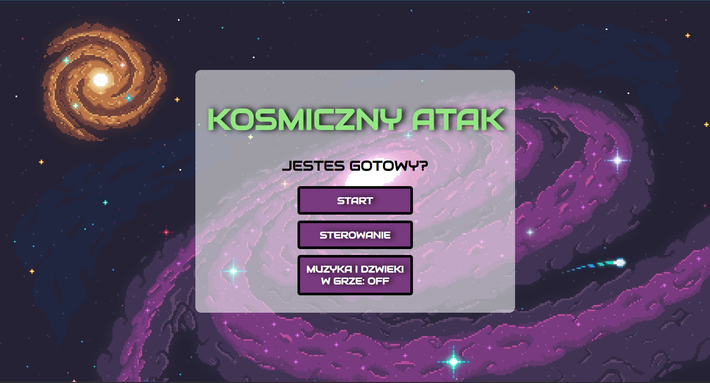
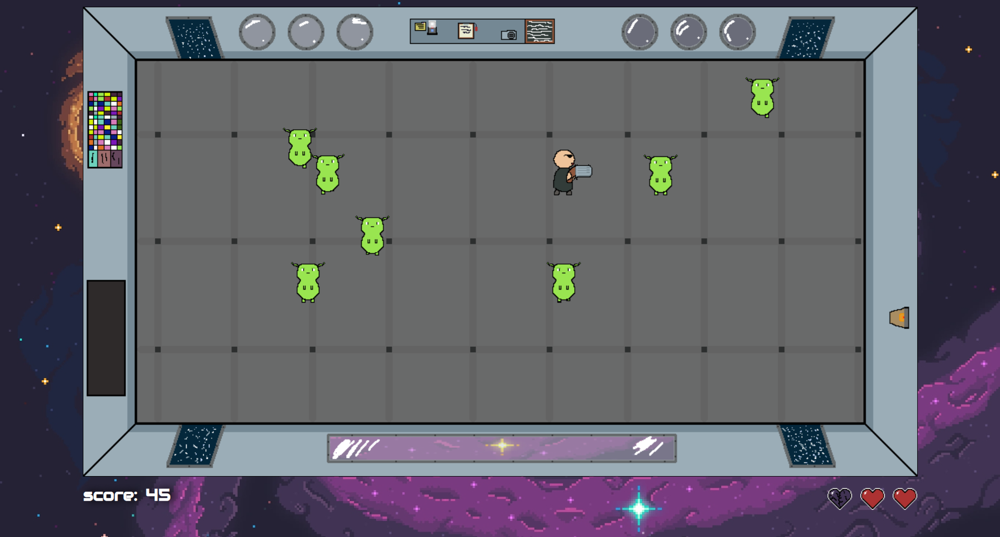
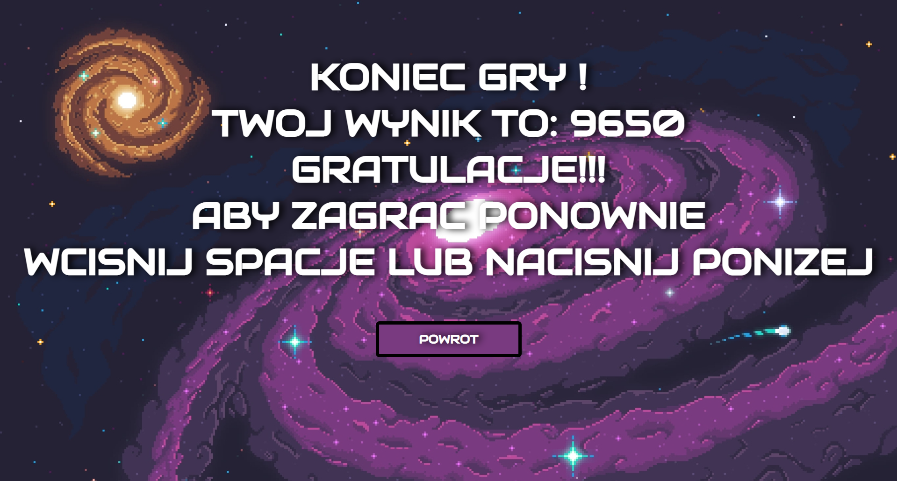

# Kosmiczny Atak - README

Witamy w grze **Kosmiczny Atak**! Poniżej znajdziesz krótki opis gry, przykłady użycia wraz z rzutami ekranu oraz instrukcję obsługi.

## Krótki opis gry

**Kosmiczny Atak** to prosta, dynamiczna gra, w której gracz wciela się w obrońcę kosmicznego statku. Twoim zadaniem jest eliminacja kosmitów, którzy próbują dostać się na statek, żeby przerwać Twoją mijsę. Musisz być szybki i precyzyjny, aby zneutralizować zagrożenie i chronić statek przed najeźdźcami.

## Przykład użycia wraz z zrzutami ekranu działania gry

### Ekran startowy

Na ekranie startowym możesz rozpocząć grę, przejść do instrukcji sterownia oraz włączyć lub wyłączyć muzykę i dźwięki.

### Rozgrywka

Podczas rozgrywki, kosmici pojawiają się w losowo co pewien interwał czasu, który jest zależny od obecnej liczby punktów. Musisz poruszać się za pomocą klawiszy WSAD i strzelać do kosmitów naciskając klawisz J. Masz tylko trzy życia, lepiej o nie dbać!

### Wynik końcowy

Po zakończeniu gry wyświetli się wynik końcowy oraz opcja powrotu do ekranu startowego.

## Instrukcja obsługi

### Sterowanie

- **W** - ruch w górę
- **S** - ruch w dół
- **A** - ruch w lewo
- **D** - ruch w prawo
- **J** - strzał

## Instalacja

Aby uruchomić grę **Kosmiczny Atak**, wykonaj następujące kroki:

1. Pobierz wszystkie plik z tego repozytorium.
2. Umieść pobrane pliki w jednym folderze.
3. Uruchom plik index.html.
4. Ciesz się grą

**Kosmiczny Atak**.
Życzę miłej zabawy i powodzenia w obronie statku!

## Dodatkowe informacje

> muzyka ze strony: [https://www.fesliyanstudios.com/](https://www.fesliyanstudios.com/)

> kosmiczne tło ze strony: [https://www.wallpaperflare.com/](https://www.wallpaperflare.com/)

> pozostałe grafiki wykonałem w programie Aseprite
